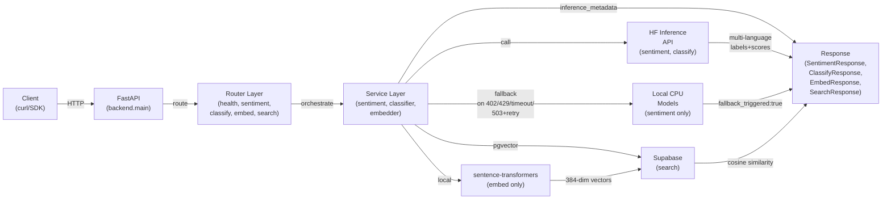

# SignalForge

**Production-grade NLP inference service on Hugging Face open-source models** — multi-language sentiment with API/local fallback, zero-shot document classification, and local embeddings with pgvector semantic search. FastAPI, CPU-only, $0 infrastructure.

Demonstrates three Hugging Face model deployments without GPU or paid compute, proving open-source ML deployment capability for Hugging Face ecosystem and NLP automation jobs.

## Architecture



Every response carries `inference_metadata`:
- `model`: full HF repo ID (e.g., `cardiffnlp/twitter-xlm-roberta-base-sentiment`)
- `provider`: exactly `"huggingface_api"` or `"local"`
- `processing_time_ms`: request duration
- `fallback_triggered`: whether the request fell back from API to local CPU
- `confidence`: top-label score (sentiment/classify) or `null` (embed/search)

## Endpoints

| Method | Path | Input | Output | Notes |
|--------|------|-------|--------|-------|
| GET | `/health` | — | `{"status": "ok"}` | Zero dependencies; always responds. |
| POST | `/api/v1/sentiment` | `{"text": "..."}` | `{label, scores, inference_metadata}` | Multi-language. Text ≤ 2000 chars. Calls HF Inference API; on 402/429/timeout or 503 after one retry, falls back to local `cardiffnlp/twitter-xlm-roberta-base-sentiment` (CPU). |
| POST | `/api/v1/classify` | `{"text": "...", "labels": [2–10]}` | `{predicted_label, scores, inference_metadata}` | Zero-shot via `facebook/bart-large-mnli` (API-only, 1.6 GB). Every error returns honest HTTP 503; no local fallback. |
| POST | `/api/v1/embed` | `{"documents": [1–20]}` | `{embeddings, count, dimensions: 384, inference_metadata}` | Local `sentence-transformers/all-MiniLM-L6-v2` (384-dim, normalized); stores each in Supabase pgvector. |
| POST | `/api/v1/search` | `{"query": "...", "k": [1–20]}` | `{results: [{id, document, similarity}], inference_metadata}` | Cosine similarity via Supabase RPC, ordered by descending similarity. |

## Try it locally

### Prerequisites

- Python 3.11+ (tested on 3.14.4)
- Hugging Face API token: [huggingface.co → Settings → Access Tokens](https://huggingface.co/settings/tokens) (read token)
- Supabase project with `vector` extension enabled and populated (see [DEPLOYMENT.md](./docs/DEPLOYMENT.md))

### Setup

```bash
# Clone the repo
git clone https://github.com/sheharyarr-ahmed/signalforge.git
cd signalforge

# Create and activate a virtual environment
python -m venv .venv
source .venv/bin/activate  # or .venv\Scripts\activate on Windows

# Install PyTorch CPU wheels FIRST (critical for image size and CI/CD reliability)
pip install torch==2.12.1 --index-url https://download.pytorch.org/whl/cpu

# Install remaining dependencies
pip install -r requirements.txt

# Create .env from .env.template and fill in your credentials
cp .env.template .env
# Edit .env: HF_API_TOKEN, SUPABASE_URL, SUPABASE_SERVICE_KEY

# Run the server
uvicorn backend.main:app --reload
```

The API is live at `http://localhost:8000`. **FastAPI's auto-generated `/docs` (Swagger UI) is the demo surface** — navigate there to test all endpoints with interactive forms.

### Verify the installation

```bash
BASE=http://localhost:8000

curl -s $BASE/health | jq .status
# Expected: "ok"

curl -s -X POST $BASE/api/v1/sentiment \
  -H 'Content-Type: application/json' \
  -d '{"text":"Este producto es increíble, lo recomiendo totalmente"}' \
  | jq '.label, .inference_metadata.provider'
# Expected: "positive", "huggingface_api" or "local"

curl -s -X POST $BASE/api/v1/classify \
  -H 'Content-Type: application/json' \
  -d '{"text":"The party of the first part agrees to indemnify...","labels":["legal","financial","marketing","technical"]}' \
  | jq .predicted_label
# Expected: "legal"

curl -s -X POST $BASE/api/v1/embed \
  -H 'Content-Type: application/json' \
  -d '{"documents":["Invoices are due within 30 days","The rocket launched successfully","Quarterly revenue grew 12 percent"]}' \
  | jq '.inference_metadata.model'
# Expected: "sentence-transformers/all-MiniLM-L6-v2"

curl -s -X POST $BASE/api/v1/search \
  -H 'Content-Type: application/json' \
  -d '{"query":"payment terms","k":2}' \
  | jq '.results[0].document'
# Expected: "Invoices are due within 30 days"
```

## Live demo

Deployed on [Hugging Face Spaces](https://huggingface.co/spaces) (free Docker SDK, CPU basic):

**`<SPACE_URL>`** (placeholder — replace with your deployed Space URL after following [DEPLOYMENT.md](./docs/DEPLOYMENT.md))

⚠️ **Important:** The free Hugging Face Space sleeps after ~48 hours of inactivity (~1 minute cold wake on first request). Supabase free tier pauses after ~7 idle days and requires manual dashboard resume. See [SCALING.md](./docs/SCALING.md) for honest free-tier limits and production upgrade paths. A daily GitHub Actions keep-alive ping (`.github/workflows/keepalive.yml`) mitigates both.

## Documentation

- **[ARCHITECTURE.md](./docs/ARCHITECTURE.md)** — request flow, error handling rationale, locked design decisions, and web-verified amendments
- **[SCALING.md](./docs/SCALING.md)** — free-tier limitations, when each breaks, and the concrete paid upgrade that fixes it
- **[DEPLOYMENT.md](./docs/DEPLOYMENT.md)** — step-by-step deployment guide including all manual UI steps
- **[SPEC.md](./SPEC.md)** — complete technical specification and decision record (D1–D14)
- **[SPEC-AMENDMENTS.md](./SPEC-AMENDMENTS.md)** — web-verified corrections and clarifications to the spec

## Stack

- **Framework:** FastAPI 0.139.0
- **Inference:** Hugging Face Inference Providers API + local CPU models (transformers, sentence-transformers)
- **Vector storage:** Supabase pgvector (PostgreSQL 15.6+)
- **Serialization:** Pydantic v2 (strict mode at every boundary)
- **Logging:** structlog JSON
- **Testing:** pytest, pytest-asyncio, pytest-httpx

## Error handling

Four-class Hugging Face error taxonomy (per SPEC-AMENDMENTS.md A2), never a generic catch-all:

| Status | Class | Route |
|--------|-------|-------|
| **402** | Quota exhausted (monthly $0.10 pool) | Sentiment: local fallback + cache until month rollover. Classify: honest HTTP 503. |
| **429** | Rate limit (5-minute window) | Sentiment: local fallback. Classify: honest HTTP 503. |
| **503/5xx** | Transient server error | Retry exactly once (250 ms delay). If still failing, fall back (sentiment) or return 503 (classify). |
| **>10s timeout** | Request exceeded timeout | Sentiment: local fallback. Classify: honest HTTP 503. |

Retry is bounded: **max 2 total attempts** (initial + one retry), transient class only, hardcoded and never configurable upward. This prevents hammering a failing endpoint or burning the free-tier credit pool.

## Models (locked)

- **Sentiment:** `cardiffnlp/twitter-xlm-roberta-base-sentiment` (~1.04 GiB on disk, ~1.1–1.5 GB loaded) — multi-language, CPU-viable, local fallback
- **Zero-shot classification:** `facebook/bart-large-mnli` (API-only, 1.6 GB) — no local fallback by design
- **Embeddings:** `sentence-transformers/all-MiniLM-L6-v2` (384-dimensional, local-only) — industry-standard free embedding

## Author

Sheharyar Ahmed (<sheharyar.softwareengineer@gmail.com>)

Portfolio artifact for SheryLabs. Single contributor, zero AI attribution. Contributions: fork + PR.
